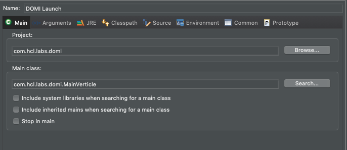
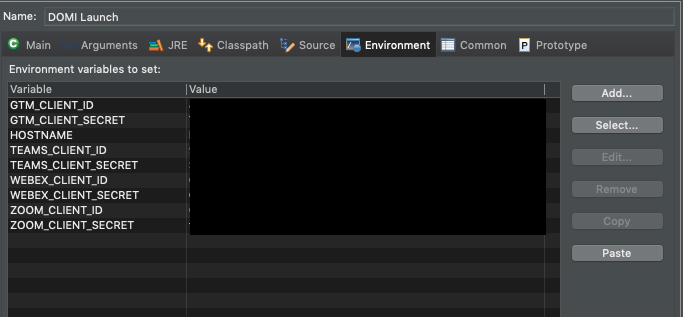

# vertx-dill-oauth

## Project Dill

image:https://img.shields.io/badge/vert.x-4.0.0-purple.svg[link="https://vertx.io"]

This application was generated using http://start.vertx.io.

## Running

You will need to set up a run configuration for the project in Eclipse. All Client IDs and Client Secrets are passed as environment variables.

The main class to run will be `com.hcl.labs.domi.MainVerticle`.

On the Environment tab, enter the following environment variables, with the relevant client ID and client secrets

## Redirect URLs

The redirect URLs will be "http://localhost:8878/" +  
- gtmCallback - GoToMeeting
- teamsCallback - Microsoft Teams
- webexCallback - Cisco Webex
- zoomCallback - Zoom

The URL to launch to trigger the OAuth dance is http://localhost:8878/" +  
- dominoGTM/index.html - GoToMeeting
- dominoTeams/index.html - Microsoft Teams
- dominoWebex/index.html - Cisco Webex
- dominoZoom/index.html - Zoom
